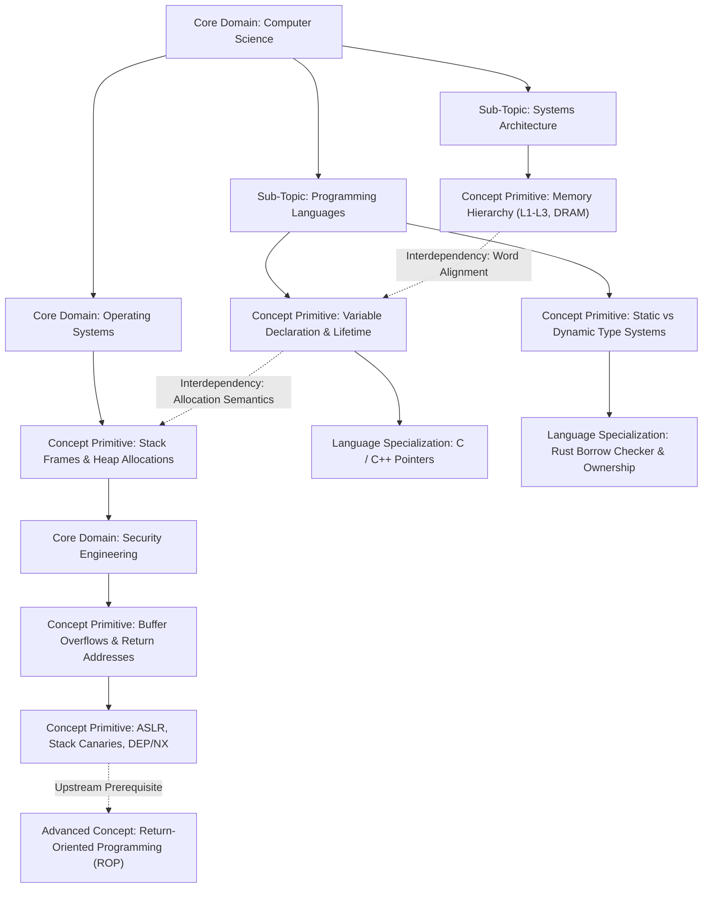

# HardCode

> **Security Engineering & Automated Versioning Edition (v1.3.0)**  
> *An automated, low-latency syntax memorization and multidimensional Knowledge Graph engine for computer science pedagogy and polyglot software engineering.*

[](https://holman57.github.io/hardcode/)
[](https://flutter.dev)
[](https://dart.dev)
[](https://github.com/holman57/hardcode)
[](https://holman57.github.io/hardcode/)

---

## System Overview

**HardCode** is an interactive, high-velocity knowledge verification and cognitive training engine engineered to establish instant recall and syntax fluency across **18 programming languages** and the foundational disciplines of **Computer Science and Systems Engineering**.

The application models pedagogical concepts as an interactive, directed **Knowledge Graph** comprising **619 vertices**, **713 directed relational edges**, and **418 interactive multi-modal questions**. HardCode continuously evaluates learner proficiency, detects conceptual struggle patterns via an **adaptive multi-tier explanation service**, and provides visual feedback through a **procedural motion graphics engine**.

The live production deployment is accessible at: [https://holman57.github.io/hardcode/](https://holman57.github.io/hardcode/)

---

## Hierarchical Curriculum Taxonomy and Interdependency Architecture

Curriculum content in HardCode is structured as a strict three-tier ontology:

$$\text{Core Master Domain (Level 0)} \supset \text{Sub-Topic Module (Level 1)} \supset \text{Concept Primitive (Level 2)}$$

### Hierarchical Containment and Inter-Domain Overlap

Concepts are not isolated flashcards; they represent nodes within a directed acyclic dependency network. For example:
- **Variable Declaration** is an atomic concept primitive ($\text{Level 2}$).
- It is a strict subset of **Programming Languages & Type Systems** ($\text{Level 1}$).
- Which is in turn a constituent subdiscipline of **Computer Science** ($\text{Level 0}$).

Simultaneously, **Variable Declaration** maintains cross-cutting interdependencies with adjacent domains:
1. **Systems Architecture & Memory Hierarchy**: Variable allocation semantics directly depend on word alignment, register assignment, and the architectural distinction between the call stack and the heap.
2. **Operating Systems**: Uninitialized stack variables or unbounded pointer arithmetic interface directly with virtual memory paging, segmentation faults, and memory management unit (MMU) protections.
3. **Security Engineering**: Improper variable bounds handling in unmanaged languages (such as C and C++) results in stack-based buffer overflows, corrupted return pointers, and arbitrary code execution—necessitating security primitives such as **Address Space Layout Randomization (ASLR)**, **Data Execution Prevention (DEP/NX)**, and **Stack Canaries**.

### Topological Progression Flow



User progression through the Knowledge Graph is governed by edge constraints: mastering upstream primitives awards mastery points that unlock downstream concepts and specialized language implementations.

---

### Curriculum Domain Taxonomy and Dependency Matrix

| Core Master Domain | Hierarchical Sub-Topics (Subsets) | Core Concept Primitives (Entities) | Upstream Prerequisites & Downstream Interdependencies |
| :--- | :--- | :--- | :--- |
| **Computer Science** | Computation Theory, Formal Automata, Algorithmic Analysis, Discrete Structures | Turing Completeness, Decidability, Halting Problem, Chomsky Hierarchy, Asymptotic Complexity ($O, \Omega, \Theta$), P vs NP | **Root Domain**: Global ontological root ($id: \text{root:hardcode}$). Unlocks sub-topic modules and defines foundational complexity bounds. |
| **Programming Languages & Compilers** | Language Semantics, Type Theory, Lexical Analysis, Parsing, Intermediate Code Generation | Variable Declaration, Scoping Rules (Lexical/Dynamic), Hindley-Milner Type Inference, AST Construction, SSA Representation, JIT Runtimes | **Upstream**: Computer Science.<br>**Downstream**: Unlocks 18 language specializations.<br>**Interdependency**: Overlaps with Systems Architecture (calling conventions) and Security Engineering (type safety, memory guarantees). |
| **Systems Architecture** | Microarchitecture, Memory Hierarchy, Instruction Sets, CPU Pipelining | Von Neumann vs Harvard, L1/L2/L3 SRAM Latency, Branch Prediction, Instruction Hazards, Cache Coherence (MESI), Translation Lookaside Buffers (TLB) | **Upstream**: Computer Science.<br>**Downstream**: Operating Systems, High-Performance Systems Languages ($C$, $C++$, Rust).<br>**Interdependency**: Dictates cache-line alignment and compiler memory layout optimizations. |
| **Operating Systems & Concurrency** | Kernel Architecture, Process Scheduling, Virtual Memory, Inter-Process Communication | Virtual Memory Paging, Demand Paging, Page Fault Handling, Mutex vs Semaphore, Coffman Deadlock Invariants, Context Switching Overhead | **Upstream**: Systems Architecture.<br>**Downstream**: Cloud Infrastructure, Container Runtimes, SRE.<br>**Interdependency**: Concurrency primitives directly govern database transactional engines and network socket event loops. |
| **Cybersecurity, Cryptography & Security Engineering** | Threat Modeling, Binary Exploitation Mitigations, Cryptographic Primitives, Secure SDLC, Zero Trust IAM, Network & Application Defenses | STRIDE / DREAD Methodologies, SAST vs DAST, ASLR, Data Execution Prevention (DEP/NX), Stack Canaries, Return-Oriented Programming (ROP), Symmetric Ciphers (AES-256-GCM), Asymmetric Cryptography (RSA, ECC), Key Derivation (Argon2id), Ephemeral TLS 1.3, Hardware Security Modules (HSM/KMS), Zero Trust Architecture | **Upstream**: Computer Science (Number Theory), Operating Systems, Systems Architecture, Computer Networking.<br>**Downstream**: Enterprise Cloud Security, Distributed Ledger Consensus, Production Systems Hardening.<br>**Interdependency**: Directly mitigates memory corruption vulnerabilities from unmanaged variable allocations and raw pointer arithmetic, while providing authenticated transport encryption for network sockets and distributed consensus nodes. |
| **Computer Networking** | Protocol Layering, Transport Protocols, Routing Infrastructure, Application Protocols | OSI 7-Layer Model, TCP 3-Way Handshake, Congestion Control (BBR vs Reno), DNS Resource Records (A, AAAA, CNAME), QUIC / HTTP/3, BGP Route Convergence | **Upstream**: Operating Systems (Socket APIs).<br>**Downstream**: Cloud Computing, Distributed Systems.<br>**Interdependency**: Transport layer round-trip times (RTT) dictate distributed consensus election timeouts and database replication lag. |
| **Cloud Computing & Distributed Systems** | Distributed Consensus, Orchestration, Microservices, Cloud Storage Architectures | CAP Theorem, PACELC Theorem, Raft Consensus, Paxos State Machines, Kubernetes Controller Loops, Service Mesh mTLS, Block vs Object Storage | **Upstream**: Computer Networking, Operating Systems.<br>**Downstream**: Site Reliability Engineering, Distributed Databases.<br>**Interdependency**: Relies on network fault-tolerance invariants and OS kernel containerization primitives (cgroups/namespaces). |
| **Database Systems & Storage Engines** | Transaction Management, Indexing Structures, Storage Layouts, Concurrency Control | ACID Guarantees, Two-Phase Commit (2PC), Write-Ahead Logging (WAL), B+ Trees vs Log-Structured Merge (LSM) Trees, Multi-Version Concurrency Control (MVCC) | **Upstream**: Systems Architecture (Disk/NVMe I/O), Operating Systems (Page Caches).<br>**Downstream**: Cloud Infrastructure, Software Architecture.<br>**Interdependency**: Implements concurrency control algorithms to resolve lock contention across table partitions. |
| **Software Engineering & Architecture** | Architectural Patterns, Object-Oriented Design, Domain-Driven Design, Continuous Delivery | SOLID Principles, Gang of Four Patterns (Adapter, Strategy, Observer, Builder), CQRS, Event Sourcing, Test-Driven Development (TDD) | **Upstream**: Programming Languages.<br>**Downstream**: Maintainability Engineering, Microservices Architecture.<br>**Interdependency**: Defines strict architectural boundaries between domain logic, persistence layers, and external APIs. |
| **DevOps & Site Reliability Engineering** | Reliability Engineering, Infrastructure as Code (IaC), Observability, Continuous Deployment | Service Level Indicators (SLIs), Service Level Objectives (SLOs), Error Budgets, Blue-Green / Canary Deployments, Chaos Engineering, Distributed Tracing | **Upstream**: Cloud Computing, Operating Systems.<br>**Downstream**: Production Service Operations.<br>**Interdependency**: Bridges software deployment pipelines with distributed runtime observability. |
| **Artificial Intelligence & Machine Learning** | Deep Neural Architectures, Optimization Algorithms, Representation Learning, Alignment | Backpropagation, Gradient Descent Variants (AdamW), Vanishing/Exploding Gradients, Self-Attention Mechanisms, Transformer Architectures, RLHF | **Upstream**: Computer Science (Linear Algebra, Optimization Theory).<br>**Downstream**: Autonomous Agent Architectures.<br>**Interdependency**: Relies on SIMD vector processing hardware and low-latency tensor storage engines. |

---

### Polyglot Language Taxonomy (18 Supported Languages)

Nodes corresponding to specific programming languages are organized along concentric orbital shells based on execution environment and type system:

1. **Native Systems Languages**:
   - `Rust`: Zero-cost abstractions, compile-time borrow checker, affine types, fearless concurrency.
   - `C`: Direct memory addressability, pointer arithmetic, manual heap management, POSIX interfaces.
   - `C++`: Resource Acquisition Is Initialization (RAII), template metaprogramming, modern move semantics.
   - `C#`: .NET Common Language Runtime (CLR), Task Parallel Library (TPL), Language Integrated Query (LINQ).
2. **Managed Runtime and Enterprise Backends**:
   - `Go`: Communicating Sequential Processes (CSP), lightweight goroutines, runtime channel multiplexing.
   - `Java`: Java Virtual Machine (JVM) bytecode, generational garbage collection, memory model invariants.
   - `Kotlin`: Null-safety type system, coroutine dispatchers, JVM interoperability.
   - `Scala`: Hybrid functional-object paradigm, higher-kinded types, actor concurrency.
3. **Web, Scripting, and Systems Automation**:
   - `TypeScript`: Static type system, structural subtyping, union/intersection types, JavaScript compilation.
   - `JavaScript`: Single-threaded event loop, asynchronous promises, prototype inheritance, V8 JIT engine.
   - `Dart`: Ahead-Of-Time (AOT) and Just-In-Time (JIT) compilation, reactive widget trees, Flutter runtime.
   - `Swift`: Automatic Reference Counting (ARC), protocol-oriented programming, LLVM native compilation.
   - `Python 3`: Dynamic typing, bytecode interpretation, Global Interpreter Lock (GIL), iterator protocols.
   - `Ruby`: Pure object-oriented reflection, dynamic method dispatch, metaprogramming DSLs.
   - `PHP`: Request-response execution lifecycle, Zend engine, modern typed properties.
   - `Bash / POSIX Shell`: UNIX pipelines, standard input/output/error stream redirection, POSIX shell scripts.
   - `PowerShell`: Object-based pipeline processing, .NET object access, Windows management automation.
   - `Lua`: Register-based virtual machine, coroutines, embeddable C application scripting.
   - `R`: S3/S4 vectorization, matrix algebra execution, statistical computing environments.

---

## Directed Knowledge Graph and Progression Mechanics

The spatial graph visualization is implemented as a directed graph $G = (V, E)$ in [`lib/widgets/knowledge_graph_3d_view.dart`](lib/widgets/knowledge_graph_3d_view.dart) and backed by the progression engine in [`lib/services/progression_service.dart`](lib/services/progression_service.dart).

### Mathematical 3D Camera Projection Model

Vertices in $\mathbb{R}^3$ are mapped to screen space $(x', y') \in \mathbb{R}^2$ using perspective camera rotation and depth-divided projection:

1. **Yaw Rotation (Around the $Y$-axis by angle $\theta_y$):**
   $$\begin{pmatrix} x_1 \\ y_1 \\ z_1 \end{pmatrix} = \begin{pmatrix} \cos\theta_y & 0 & \sin\theta_y \\ 0 & 1 & 0 \\ -\sin\theta_y & 0 & \cos\theta_y \end{pmatrix} \begin{pmatrix} x \\ y \\ z \end{pmatrix}$$

2. **Pitch Rotation (Around the $X$-axis by angle $\theta_p$):**
   $$\begin{pmatrix} x_2 \\ y_2 \\ z_2 \end{pmatrix} = \begin{pmatrix} 1 & 0 & 0 \\ 0 & \cos\theta_p & -\sin\theta_p \\ 0 & \sin\theta_p & \cos\theta_p \end{pmatrix} \begin{pmatrix} x_1 \\ y_1 \\ z_1 \end{pmatrix}$$

3. **Perspective Division and Optical Depth Scaling:**
   Given focal length $f = 600.0$, camera distance $d_{\text{cam}} = 750.0$, and user zoom scale $z_{\text{zoom}} \in [0.4, 3.0]$:
   $$z_{\text{eff}} = \max(z_2 + d_{\text{cam}}, 25.0)$$
   $$S = \frac{f \cdot z_{\text{zoom}}}{z_{\text{eff}}}$$

4. **Viewport Center Mapping with Vertical Offset:**
   To guarantee that floating graph nodes remain completely unobstructed by the collapsible bottom inspection sheet, the vertical center coordinate $y_c$ is calibrated to $38\%$ of total viewport height:
   $$x' = \left(\frac{W_{\text{viewport}}}{2} + \Delta x_{\text{pan}}\right) + x_1 \cdot S$$
   $$y' = \left(0.38 \cdot H_{\text{viewport}} + \Delta y_{\text{pan}}\right) + y_2 \cdot S$$

5. **Depth-Sorted Rendering (Painter's Algorithm):**
   Projected vertices are sorted in ascending order of transformed depth $z_2$ prior to rendering:
   $$\text{RenderOrder} = \text{sort}_{\le z_2}(\{v \in V\})$$
   Background edges and nodes are drawn with distance attenuation ($\alpha \propto z_{\text{eff}}^{-1}$), ensuring visual hierarchy and eliminating z-fighting.

### Topological Cascading Unlock Algorithm

Node availability is evaluated using fixed-point topological relaxation whenever mastery points are awarded:

$$\text{CanUnlock}(v) \iff \forall u \in \text{Prerequisites}(v) : \left(\text{Status}(u) \neq \text{Locked} \;\land\; \text{Points}(u) \ge \text{PointsToUnlock}(v)\right)$$

Upon completing a question, the system increments the target node's points ($\Delta P$) and iteratively traverses downstream edges until no further transitions occur:

```dart
// Fixed-point topological resolution loop
bool changed = true;
while (changed) {
  changed = false;
  for (final node in nodes.values) {
    if (node.isUnlocked) continue;
    bool canUnlock = node.prerequisiteIds.every((prereqId) {
      final parent = nodes[prereqId];
      return parent != null && parent.isUnlocked && parent.points >= node.pointsToUnlock;
    });
    if (canUnlock) {
      node.status = TopicUnlockStatus.unlocked;
      changed = true;
    }
  }
}
```

---

## Cognitive Evaluation Modalities

HardCode provides five distinct cognitive evaluation modalities, each designed to test a different tier of mental representation:

1. **Multiple Choice (Syntax & Conceptual Verification)**:
   - Evaluates syntax recognition against realistic compiler error and runtime distractors.
   - Requires disambiguating language semantics (e.g., pass-by-value vs pass-by-reference).
2. **True / False Binary Rapid Evaluation**:
   - Tests binary invariants, language edge cases, operator precedence rules, and algorithmic complexity limits.
   - Calibrated for sub-second rapid decision making.
3. **Term & Definition Bipartite Matching**:
   - Renders dual-column shuffled lists requiring the learner to establish one-to-one correspondences between architectural patterns, memory models, and definitions.
   - Requires full matrix resolution before point settlement.
4. **Real-Time Sequential Pipeline Ordering**:
   - Tests execution pipelines (e.g., TLS 1.3 handshakes, compiler lowering stages, TCP teardown sequences).
   - Features real-time drag-and-drop swap mechanics and directional step triggers.
5. **Categorical Classification & Partitioning**:
   - Requires partitioning a set of concepts into disjoint architectural bins (e.g., Symmetric vs Asymmetric Ciphers, Stack vs Heap Allocations, RISC vs CISC).
   - Validates multi-attribute taxonomy retention under time pressure.

---

## Adaptive Pedagogical Struggle-Detection Engine

Implemented in [`lib/services/adaptive_explanation_service.dart`](lib/services/adaptive_explanation_service.dart), this subsystem dynamically monitors error trajectories and intervenes when conceptual deficits are identified.

### State Tracking and Struggle Quantification

For each distinct topic $t \in T$, the engine maintains an interaction state vector:

$$\mathbf{S}_t = \big(M_t, \; C_t, \; N_t, \; \tau_{\text{last}}\big)$$

Where $M_t$ is total misses, $C_t$ is consecutive misses, $N_t$ is total attempts, and $\tau_{\text{last}}$ is the turn index of the previous remediation event.

### Remediation Escalation Policy

When a learner answers incorrectly, the system escalates remediation across three pedagogically distinct tiers:

$$\text{Tier}(C_t) = \begin{cases} 
1 \; (\text{Key Insight}) & \text{if } C_t = 1 \\
2 \; (\text{Deep Dive Mechanics}) & \text{if } C_t = 2 \\
3 \; (\text{Architectural Masterclass}) & \text{if } C_t \ge 3 
\end{cases}$$

- **Tier 1 (Key Insight)**: Concise mental model refresh, immediate mnemonic, and invariant statement.
- **Tier 2 (Deep Dive Mechanics)**: Structural mechanics, concrete code snippets, and memory layout diagrams.
- **Tier 3 (Architectural Masterclass)**: Low-level runtime deep dive, compiler translation phases, and hardware-level constraints.

### Adaptive Dwell Time Formulation

To prevent learners from impulsively dismissing explanations during severe struggle states, the required on-screen dwell time $T_{\text{dwell}}$ scales as a function of tier and consecutive error depth:

$$T_{\text{dwell}}(C_t) = \left\lfloor 4.0 + (\text{Tier}(C_t) - 1) \cdot 3.0 + \min(C_t \cdot 1.5, \; 5.0) \right\rceil \quad \text{[seconds]}$$

| Struggle Level | Consecutive Misses ($C_t$) | Active Tier | Dwell Duration Range |
| :--- | :--- | :--- | :--- |
| **Initial Error** | 1 | Tier 1 (Key Insight) | 4.0s – 5.5s |
| **Persistent Error** | 2 | Tier 2 (Deep Dive) | 7.0s – 9.0s |
| **Critical Deficit** | $\ge 3$ | Tier 3 (Architectural Masterclass) | 10.0s – 13.0s |

### Exponential Backoff Throttling

To prevent cognitive fatigue and banner spam during review sessions, remediation displays are throttled by an exponential interaction interval:

$$\Delta\tau_{\text{min}} = \begin{cases}
1 & \text{if } K_t \le 1 \\
\min\left(8, \; 2^{K_t - 1}\right) & \text{if } K_t > 1
\end{cases}$$

Where $K_t$ is the cumulative count of explanations previously shown for topic $t$. If $C_t \ge 2$ (indicating urgent struggle), the threshold is halved: $\Delta\tau_{\text{required}} = \max\left(1, \; \lfloor \Delta\tau_{\text{min}} / 2 \rfloor\right)$.

---

## Procedural Motion Graphics Architecture

Rendered by [`lib/widgets/motion_graphics_overlay.dart`](lib/widgets/motion_graphics_overlay.dart), this engine provides vector feedback for performance milestones without external raster assets:

- **Particle Kinetics**: Evaluated per tick using Newtonian equations of motion:
  $$\mathbf{p}(t + \Delta t) = \mathbf{p}(t) + \mathbf{v}(t)\Delta t, \quad \mathbf{v}(t + \Delta t) = \mathbf{v}(t) \cdot \gamma + \mathbf{a}\Delta t$$
  Where $\gamma \in [0.92, 0.98]$ represents velocity damping.
- **Milestone Triggers**:
  - *Level Initialization*: Expanding cosmic starburst with radial velocity vectors.
  - *Level Completion*: Golden particle vortex with celestial achievement banner.
  - *Streak 3 (Spark)*: Amber particle emitter with pulse oscillations.
  - *Streak 5 (Inferno)*: Double-layered flame particles with kinetic acceleration.
  - *Streak 10 (Hyperdrive)*: Cyan radiant shockwave with warp-speed light streaks.
  - *Streak 20 (Singularity)*: Violet logarithmic spiral ($r = a e^{b\theta}$) with chromatic aberration offset passes.
- **Immediate Dismissal Pipeline**: All particle tickers are non-blocking and register touch-anywhere or key-down handlers to allow instant dismissal without interrupting input velocity.

---

## Automated Semantic Versioning and CI/CD Synchronization

HardCode includes an automated Semantic Versioning ($SemVer$) management engine implemented in [`scripts/bump_version.py`](scripts/bump_version.py).

### Version Synchronization Pipeline

The system enforces [`version.json`](version.json) as the single source of truth:

```json
{
  "version": "1.3.0",
  "build_number": 1,
  "edition": "Security Engineering & Automated Versioning Edition",
  "updated_at": "2026-09-12T19:40:58Z"
}
```

Running `python scripts/bump_version.py` executes atomic multi-target synchronization across:
1. `version.json`: Increments version and monotonic build integer.
2. `pubspec.yaml`: Replaces `version: X.Y.Z+build`.
3. `README.md`: Updates release edition header subtitle and shield status badges.
4. `assets/knowledge_graph.json`: Updates internal `graph_version` and metadata timestamps.
5. `assets/db.json`: Synchronizes root database metadata schema version.

### Automated Git Hook Lifecycles

Git hooks are installed via `python scripts/setup_git_hooks.py`:
- **Post-Merge Hook (`.git/hooks/post-merge`)**: Triggered automatically when branches are merged; calculates next minor version bump and creates a synchronized release commit.
- **Pre-Push Hook (`.git/hooks/pre-push`)**: Executes the full Python automated test suite prior to allowing pushes to remote branches. Rejects pushes if tests fail or version metadata is desynchronized.

```bash
# Manual version bumping CLI commands
python scripts/bump_version.py --type patch   # 1.3.0 -> 1.3.1
python scripts/bump_version.py --type minor   # 1.3.0 -> 1.4.0
python scripts/bump_version.py --type major   # 1.3.0 -> 2.0.0
python scripts/bump_version.py --sync-only    # Re-sync across all 5 files without incrementing
```

---

## System Architecture and Runtime Specifications

- **Client Runtime**: [Flutter Web](https://flutter.dev/multi-platform/web) running on the Dart SDK with HTML5 Canvas / WebGL accelerated rendering.
- **Responsive Viewport Layout**: Dynamic breakpoints adapting seamlessly across mobile viewports, high-density desktop displays ($4\text{K}$), and ultra-wide aspect ratios.
- **Client-Side Persistence**: [Hive](https://pub.dev/packages/hive) binary key-value storage (`TypeAdapter` serialization) for offline-first persistence of XP progress, unlocked nodes, and interaction history.
- **Knowledge Graph Database**: In-memory adjacency graph index loaded from serialized JSON (`assets/knowledge_graph.json`), supporting $O(1)$ node lookups and $O(|V| + |E|)$ topological traversals.
- **Automated Test Coverage**: Python validation suite (`python -m unittest discover -s test`) running 38 automated tests in $< 0.45\text{s}$, verifying graph integrity, question evaluators, and version bump synchronization.

---

## Local Development and Verification Protocols

### Prerequisites
- [Flutter SDK](https://docs.flutter.dev/get-started/install) ($\ge 3.1.5$)
- [Python 3.10+](https://www.python.org/)
- [Google Chrome](https://www.google.com/chrome/) or standard Chromium-based browser

### Execution Commands

1. **Clone the repository:**
   ```bash
   git clone https://github.com/holman57/hardcode.git
   cd hardcode
   ```

2. **Execute automated verification suite:**
   ```bash
   python -m unittest discover -s test
   ```

3. **Validate and rebuild Knowledge Graph schema:**
   ```bash
   python scripts/build_knowledge_graph.py --validate
   ```

4. **Install automated Git hooks:**
   ```bash
   python scripts/setup_git_hooks.py
   ```

5. **Launch development server:**
   ```bash
   flutter run -d chrome
   ```

---

## License

This software is distributed under the [MIT License](LICENSE).
